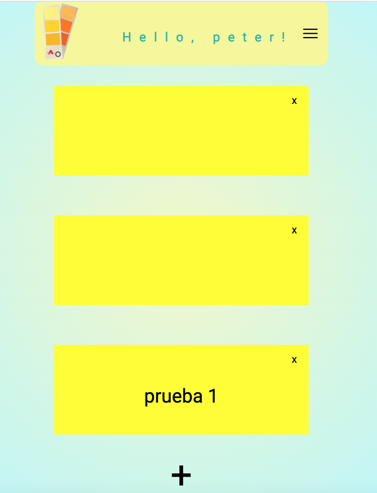

# Postits Vanilla

Postits is an application to create, save and delete small notes in a private way, here the user can register and start creating his notes, it has a central panel where he saves them so that when he enters he can see the notes created previously. It has been designed to focus on giving users the opportunity to have an application to save small reminders or notes of interest, you can also make changes to the notes created.
The application was created in vanilla, but it has React which was added to the website without using create-react-app by copying some script elements into the HTML file, and once this was done some were used. hooks to make the application.
The Postits application is a great opportunity for those who like to have small reminders or notes of interest in one place, as well as ensuring that the user has the best experience at all times, providing striking colors to it.

# Functional Description

## Use Cases
### User
- See profile (postits).
- Add, remove and update notes.
- Change Password.
- Logout.

# Flows

# UI design (wireframes)

## Technologies
- Javascript, JSX, CSS,HTML
- React
